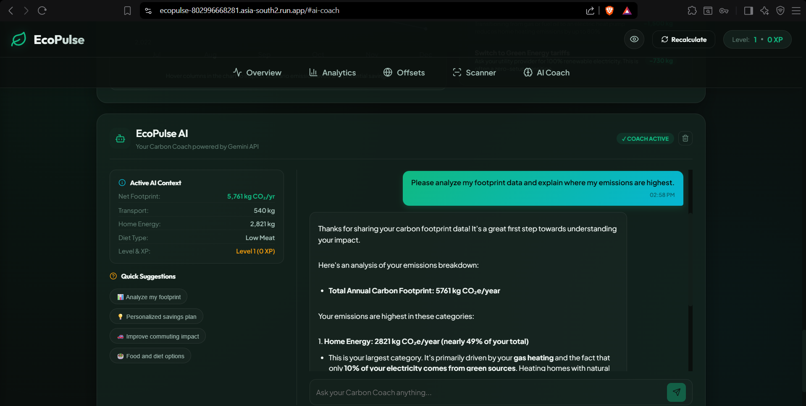
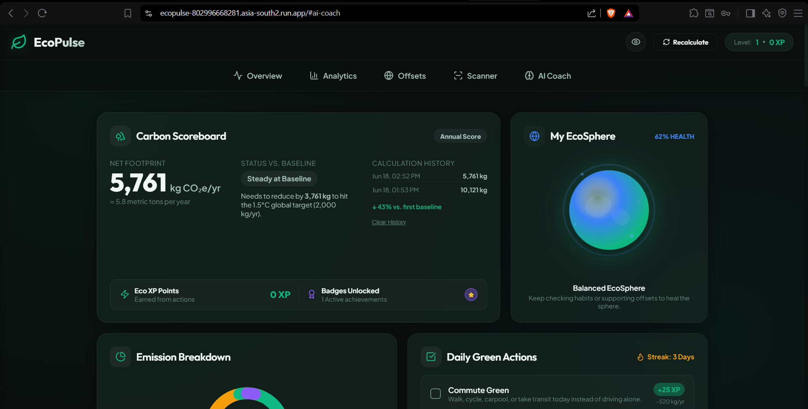
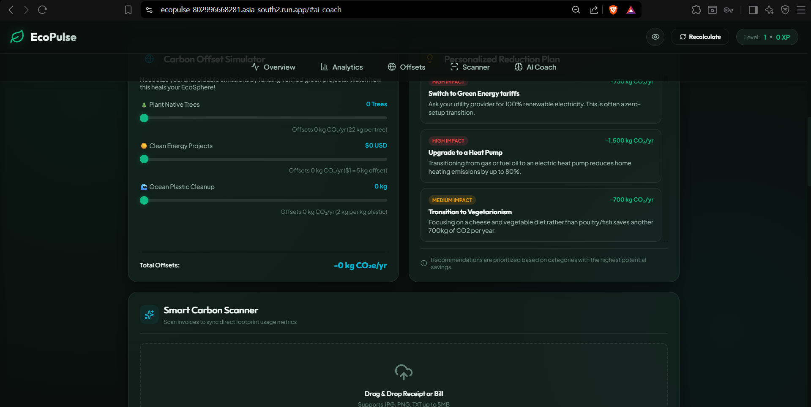
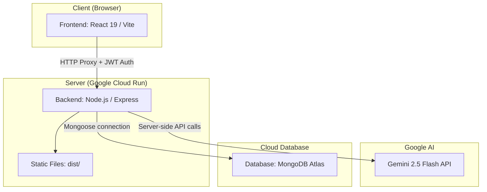

# EcoPulse 🌍

## 📖 Project Overview
**EcoPulse** is an intelligent, AI-powered carbon footprint tracker that helps individuals understand and reduce their environmental impact. It combines a modern React frontend with a secure Node.js/Express backend proxy, leveraging the Gemini Multimodal AI for smart document scanning, personalized recommendations, and conversational AI assistance.

## ❓ Problem Statement
In the fight against climate change, awareness is the first step. However, calculating personal carbon footprints is often tedious, manual, and prone to inaccuracies. People lack a simple, automated way to extract carbon emission data from everyday documents (electricity bills, fuel receipts, shopping invoices) and visualize their environmental impact in a meaningful way.

## ✨ Features
* **Smart Carbon Scanner**: Upload electricity bills, fuel receipts, or shopping invoices via drag-and-drop. The Gemini Multimodal API extracts text and calculates your carbon footprint automatically, with a local regex-based fallback for text-only files.
* **Complete User Authentication**: Secure Register, Login, Forgot Password, and Reset Password flows with bcryptjs password hashing and JWT sessions.
* **Persistent Progress Tracking**: Real-time state hydration with MongoDB to persist carbon history, streaks, logged habits, and AI chat logs across devices.
* **Interactive Dashboard**: View real-time carbon metrics across multiple bento-grid cards.
* **EcoPulse AI Chat**: An in-app AI assistant powered by Gemini for personalized eco-advice with chat history persistence.
* **Carbon Forecast**: Predictive charts showing your projected emissions trajectory.
* **Smart Recommendations**: Actionable, AI-generated insights tailored to your footprint profile.
* **Habit Tracker & Gamification**: Earn XP, build streaks, and unlock levels by completing daily green habits.
* **Challenge Tracker**: Take on carbon-reduction challenges and track completion.
* **Carbon Offset Simulator**: Simulate the impact of green project contributions (tree planting, clean energy, plastic cleanup).
* **Carbon Personality Card**: Discover your environmental archetype based on your habits.
* **EcoSphere Visualization**: An interactive 3D-style globe visualization of your carbon footprint.
* **Accessibility Settings**: Built-in accessibility options for a more inclusive experience.
* **Premium UI/UX**: Glassmorphism, micro-animations, and a dark-mode design system built with Vanilla CSS.

## 📸 Screenshots

### 🤖 AI Coach Analysis


### 📊 Interactive Dashboard & EcoSphere


### 🌳 Carbon Offset Simulator & Reduction Plan


## 🏗️ Architecture


The Express server acts as a **secure backend proxy and API gateway**:
- **Authentication**: Validates JWTs for protected endpoints such as `/api/profile/*` and `/api/chat/*`.
- **Database Access**: Securely connects to MongoDB Atlas using Mongoose to persist user credentials, settings, habits, history, and chat logs.
- **API Key Protection**: The Gemini API key and MongoDB connection credentials are **never exposed to the client**.
- **Static Hosting**: Serves the production-built React SPA from the `dist/` directory.

## 💻 Tech Stack

| Layer | Technology |
|---|---|
| **Frontend** | React 19, Vite 8 |
| **Backend** | Node.js, Express 5 |
| **Database** | MongoDB Atlas, Mongoose 8 |
| **Authentication** | JSON Web Tokens (JWT), bcryptjs |
| **Styling** | Vanilla CSS (Glassmorphism, Dark Mode) |
| **Icons** | Lucide React |
| **AI** | Google Gemini 2.5 Flash (Multimodal API) |
| **Security** | express-rate-limit, CORS whitelist, dotenv |
| **Animations** | canvas-confetti |
| **Testing** | Vitest, React Testing Library, jsdom |
| **Containerization** | Docker (multi-stage build) |
| **Deployment** | Google Cloud Run |
| **Tooling** | ESLint, Node.js 20 |

## 🚀 Installation Guide

### Prerequisites
- Node.js 20+
- A MongoDB cluster (local or MongoDB Atlas)
- A Gemini API key from [Google AI Studio](https://aistudio.google.com/)

### 1. Clone the repository
```bash
git clone https://github.com/your-username/ecopulse.git
```

### 2. Install dependencies
```bash
npm install
```

### 3. Set up environment variables
Create a `.env` file in the root directory:
```env
VITE_GEMINI_API_KEY=your_gemini_api_key_here
MONGODB_URI=mongodb://your_mongodb_connection_string
JWT_SECRET=your_jwt_secret_key
```
> **Note:** Although the API key is prefixed with `VITE_`, it is only read by the **server-side** Express proxy (`server.js`) and is never bundled into the client. The `VITE_` prefix is retained for backwards compatibility.

### 4. Run the development server (frontend only)
```bash
npm run dev
```
This starts the Vite dev server at `http://localhost:5173`. Ensure your backend server is running concurrently on port `8080` if testing authentication and profile persistence.

### 5. Run the production server (frontend + backend)
First build the frontend, then start the Express server:
```bash
npm run build
npm start
```
The server will serve both the API and the static frontend at `http://localhost:8080`.

### 6. Run Tests
```bash
# Run all tests once
npm run test

# Run in watch mode
npm run test:watch

# Generate coverage report
npm run test:coverage
```

## 🐳 Docker & Cloud Deployment

### Build and run with Docker locally
```bash
docker build -t ecopulse .
docker run -p 8080:8080 \
  -e VITE_GEMINI_API_KEY=your_gemini_key_here \
  -e MONGODB_URI=your_mongodb_uri_here \
  -e JWT_SECRET=your_jwt_secret_here \
  ecopulse
```

### Deploy to Google Cloud Run
The app is configured for deployment to Google Cloud Run. Ensure you have the `gcloud` CLI set up, then run the deployment command. 

> **Important:** Since MongoDB Atlas connection strings for replica sets contain commas, you must specify a custom delimiter (like `;`) for the `--set-env-vars` flag to avoid parsing errors.

```bash
gcloud run deploy ecopulse \
  --source . \
  --region asia-south2 \
  --project YOUR_PROJECT_ID \
  --allow-unauthenticated \
  --set-env-vars "^;^MONGODB_URI=your_mongodb_connection_string;VITE_GEMINI_API_KEY=your_gemini_key;JWT_SECRET=your_jwt_secret"
```

**Live Demo:** [https://ecopulse-802996668281.asia-south2.run.app](https://ecopulse-802996668281.asia-south2.run.app)

## 🔒 Security Features
* **Authentication & Authorization**: Password hashing using `bcryptjs` and user session tokens signed with `jsonwebtoken` (JWT).
* **Protected Routes**: Middleware verifies authentication tokens on all user-specific profile, habit, and chat routes.
* **API Key Protection**: Sensitive API keys and database credentials live exclusively on the server, never exposed in client bundles.
* **Rate Limiting**: All `/api/*` routes are rate-limited using `express-rate-limit` to prevent denial-of-service and brute-force attacks.
* **CORS Whitelist**: Restricts API calls to approved origins (the production URL and `localhost:5173`).
* **Payload Constraints**: JSON request sizes are capped at `10mb`.

## 🧪 Testing Strategy
* **Unit Testing**: Utility functions (e.g., `carbonCalculations.js`, `scannerEngine.js`) tested with **Vitest**.
* **Component Testing**: React components (e.g., `CarbonScannerCard.jsx`, `AuthPage.jsx`) tested with **React Testing Library**.
* **Coverage Tracking**: Automated coverage reports via `@vitest/coverage-v8` with enforced thresholds (80% lines/functions/statements, 75% branches).

## ♿ Accessibility Compliance
* **Semantic HTML**: Strict use of HTML5 semantic elements for screen reader compatibility.
* **Keyboard Navigation**: All interactive elements (including drag-and-drop uploader) are fully keyboard-navigable.
* **ARIA Attributes**: Applied to dynamic content and status indicators.
* **Built-in Settings**: An in-app `AccessibilitySettings` panel for user-controlled adjustments.

## 📦 Project Structure
```
ecopulse/
├── models/
│   └── User.js           # Mongoose User database schema
├── src/
│   ├── components/
│   │   ├── AccessibilitySettings.jsx
│   │   ├── AuthPage.jsx  # Authentication views (Login/Register/Recovery)
│   │   ├── CarbonForecastCard.jsx
│   │   ├── CarbonPersonalityCard.jsx
│   │   ├── CarbonScannerCard.jsx
│   │   ├── CarbonScoreCard.jsx
│   │   ├── ChallengeTrackerCard.jsx
│   │   ├── ChartCard.jsx
│   │   ├── EcoPulseAI.jsx
│   │   ├── EcoSphere.jsx
│   │   ├── HabitTrackerCard.jsx
│   │   ├── Navbar.jsx
│   │   ├── OffsetSimulatorCard.jsx
│   │   ├── OnboardingWizard.jsx
│   │   └── RecommendationsCard.jsx
│   ├── utils/            # Carbon calculations, scanner engine, etc.
│   ├── __tests__/        # Integration & unit tests
│   ├── App.jsx           # Main application dashboard & routing
│   ├── index.css         # Global design system
│   └── main.jsx
├── server.js             # Express API gateway & proxy server (production)
├── Dockerfile            # Multi-stage Docker build
├── vite.config.js        # Vite + Vitest configuration
└── package.json
```

## 🔭 Future Scope
* **Social Sharing**: Allow users to share carbon reduction milestones on social media.
* **Organizational Accounts**: Scale the platform to support enterprise-level footprint tracking and ESG reporting.
* **Push Notifications**: Remind users of daily habit challenges and streaks.
